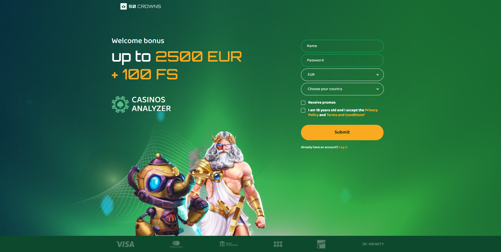
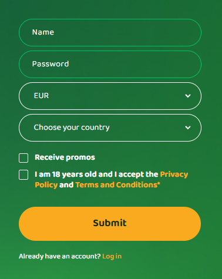

# 50-crowns landing page (real order)

[Here you can check it](https://artemuholkov.github.io/50-crowns-land/)

---

I had figma design for this project.
This landing page is 100% responsive for all types of screens.
I used HTML, CSS, JS in this project.

---

###What was interesting in this project:

1. This landing page has only main fullscreeen section.



2. Form with custom checkers



3. Different text appears depends on your time zone.


```
 const title = document.querySelector('.title');
const timezone = Intl.DateTimeFormat().resolvedOptions().timeZone;
console.log(timezone);
if (
  timezone == 'America/Denver' ||
  timezone == 'America/Los_Angeles' ||
  timezone == 'America/Chicago' ||
  timezone == 'America/New_York' ||
  timezone == 'America/Halifax' ||
  timezone == 'America/St_Johns'
) {
  title.innerHTML = `up to <span class="accent_text">3500 CAD<br />+ 100 FS</span>`;
} else if (timezone == 'Pacific/Auckland' || timezone == 'Pacific/Chatham') {
  title.innerHTML = `up to <span class="accent_text">3500 NZD<br />+ 100 FS</span>`;
} else if (
  timezone == 'Australia/Perth' ||
  timezone == 'Australia/Adelaide' ||
  timezone == 'Australia/Darwin' ||
  timezone == 'Australia/Brisbane' ||
  timezone == 'Australia/Hobart'
) {
  title.innerHTML = `up to <span class="accent_text">3500 AUD<br />+ 100 FS</span>`;
} else {
  title.innerHTML = `up to <span class="accent_text">2500 EUR<br />+ 100 FS</span>`;
}
```

---
